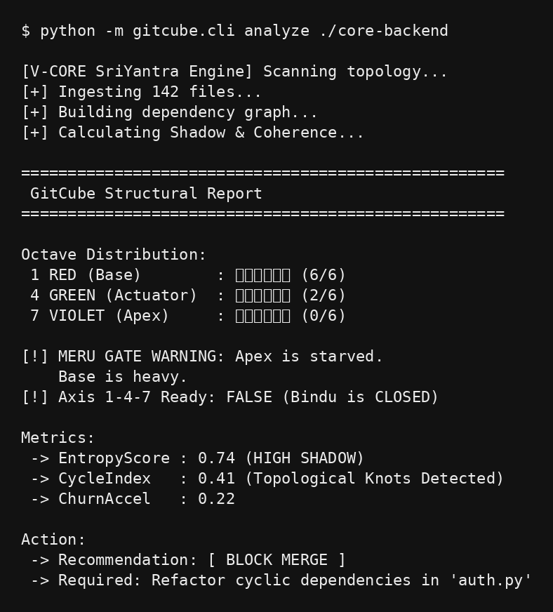

# gitcube-core



**Structural Stability & Entropy Analyzer for Git Repositories**

GitCube Core turns a repo into a **dependency structure** and computes a compact set of **stability / entropy** signals.  
Goal: detect architectural “instability build-up” early and provide an explainable merge gate: **ALLOW / WARN / BLOCK**.

## Quick start

### 1) Install
```bash
python -m venv .venv
source .venv/bin/activate
pip install -e .
```

### 2) Analyze a repo
```bash
gitcube analyze .
```

### 2b) Analyze and emit JSON (for CI/CD & AI agents)
```bash
gitcube analyze . --json > gitcube_report.json
```

### 3) Generate a tiny demo repo (with a cycle) and analyze it
```bash
python examples/demo_repo_generator.py
gitcube analyze demo_repo
```

## What you get (v0.1 MVP)
- Dependency graph extraction (Python imports)
- Metrics:
  - `EntropyScore` (0..1)
  - `CycleIndex`
  - `ChurnAccel` (placeholder; becomes real when git history is enabled)
- Recommendation:
  - `ALLOW` (<0.40)
  - `WARN` (0.40..0.65)
  - `BLOCK` (>=0.65) → **MERU GATE WARNING**

## Repository structure
- `src/gitcube/` core library
- `src/gitcube/cli.py` command line entry
- `examples/` minimal demos
- `docs/` concept + metrics

## License
AGPL-3.0
